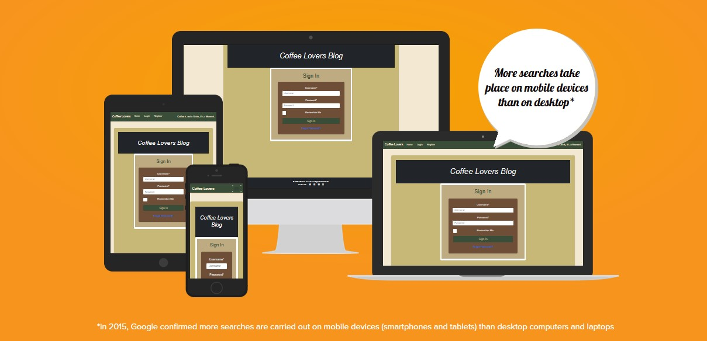
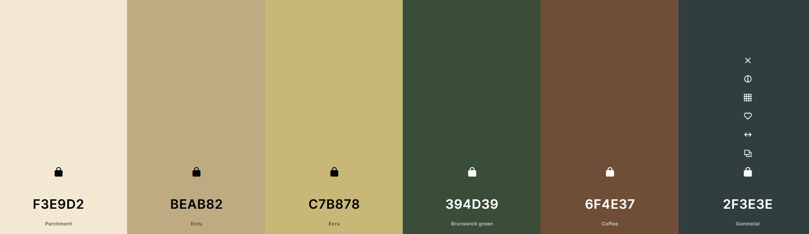
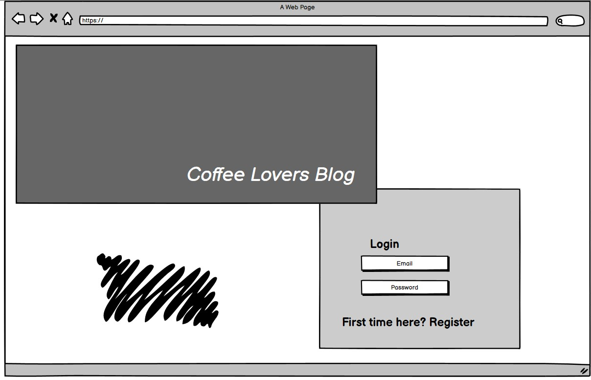
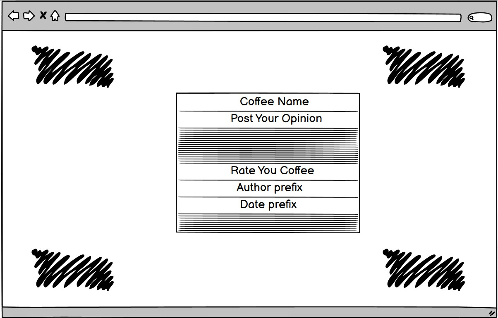
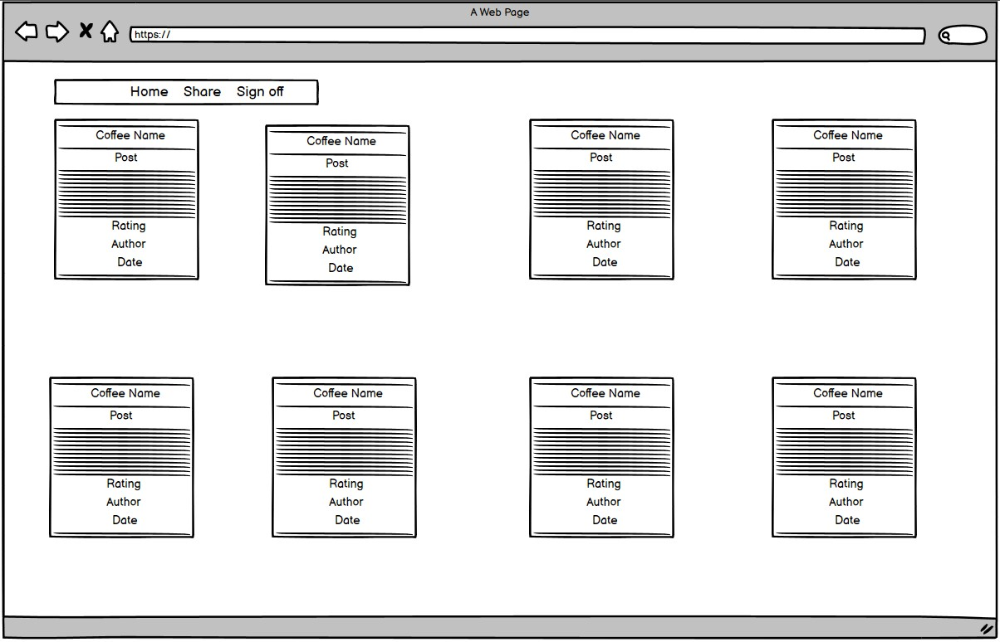

# Coffee Lovers Blog

**Coffee Lover** is a community-driven blog for coffee enthusiasts. This platform allows users to share their coffee experiences, opinions, and discoveries about different types of coffee from around the world. Whether you are a seasoned barista or just starting your coffee journey, Coffee Lover is the perfect place to connect with like-minded individuals.

### Project Overview

The Coffee Lover blog provides a space for coffee lovers to explore, discuss, and review and rate various coffee types, origens, and coffee shop recommendations. the user can create a librery of all the types of coffee that were memorable for good and bad, and share the experience. Built with Django and Bootstrap, it offers an intuitive user experience focused on engagement and knowledge-sharing.

[Live Demo](https://coffee-blog-club-f5fa03120763.herokuapp.com)
---

## Table of Contents

1. [Features](#features)
2.  [User Experience UX](#user-experience-ux)
   - [User Stories](#user-stories)
   - [Wireframes](#wireframes)
3. [Technologies Used](#technologies-used)
4. [Deployment](#deployment)
5. [Testing](#testing)
6. [Known Issues and Future Features](#known-issues-and-future-features)
7. [Credits](#credits)
   - [Resources Used](#resources-used)
   - [Acknowledgements](#acknowledgements)

## Features

- **User Registration and Authentication**
  - Users can register, log in, and log out securely.

- **Create, Update, and Delete Blog Posts**
  - Users can write and manage their own coffee-related blog posts.
  - Posts include images, descriptions, and tags to help categorize content.

- **Rate, Update, and  Posts**
  - Users can Rate their own coffee posts.

- **Interactive User Engagement**
  - Users can comment, rate and blog posts from oder users.
  - Comments section allows discussion and exchange of coffee experiences.

- **Featured Articles and Recommendations**
  - Curated lists of must-try coffee beans, and cafés.

- **Admin Panel for Content Moderation**
  - Admins can manage posts, comments, rates and user interactions.

- **Responsive Design**
  - Create with the theory mobile devices first, then optimized for desktop, tablet.

## User Experience (UX)
#### Palette

- This palette is designed to bring a sense of warmth, sophistication, and natural balance. the colors blend to create a cohesive aesthetic with the product "Coffee". This soft neutrals, rich earth tones, ensure a visually appealing and user-friendly experience across various applications.

| Hex Code  | Name              | Description |
|-----------|------------------|-------------|
| `#F3E9D2` | Parchment        | A soft, warm beige resembling old parchment. |
| `#BEAB82` | Ecru             | A muted, natural beige with earthy undertones. |
| `#C7B878` | Ecru             | A slightly deeper variation of ecru with golden hues. |
| `#394D39` | Brunswick Green  | A deep green shade, often associated with nature and tranquility. |
| `#6F4E37` | Coffee           | A rich brown hue, evoking the warmth of roasted coffee beans. |
| `#2F3E3E` | Gunmetal         | A dark, muted gray-green, giving a sophisticated industrial feel. |

### User Stories

#### as a Visitor.
- As a visitor, I want to register for an account, so I can engage with posts and share my own experiences.

#### as a User.

- As a registered user, I want to create blog posts, so I can share my coffee experiences and recommendations.
- As a registered user, I want to edit or delete my own posts, so I can update or remove content when needed.
- As a registered user, I want to comment on blog posts, so I can engage in discussions with other coffee lovers.
- As a registered user, I want to rate the coffee in my posts as well as the other users post, so at the end as a community we can have a general rate.

#### Admin Users
- As an admin, I want to moderate blog posts, so I can ensure high-quality and appropriate content.
- As an admin, I want to manage user comments, so I can remove any offensive or irrelevant content.
- As an admin, I want to feature specific blog posts, so I can highlight valuable contributions from the community.

#### Blog Owner
- As the blog owner, I want to create an online store, so I can sell different types of coffee and accessories to my audience.
- As the blog owner, I want to offer subscription-based coffee deliveries, so users can receive curated coffee selections regularly.
  
### Wireframes
-The wireframes for the **Coffee Lovers Blog** outline the essential pages required the user experience. These designs focus on usability, clarity, and accessibility. with an easy flow for users to navigate the platform, from logging in to creating and browsing coffee reviews.

**Login Page**
- Displays blog branding and login fields.
- Includes registration link for new users.
- Simple and user-friendly design.

**Post Creation Page**
- Users enter coffee name and write opinions.
- Includes a rating system.
- Displays author and date information.

**Homepage & Post Listings**
- Shows coffee posts in a grid format.
- Each post includes name, rating, author, and date.
- Navigation bar for easy access to key sections.

  
## Technologies Used

### Languages and Frameworks

- **Python** - Back-end development
- **Django** - Web framework
- **Bootstrap** - Front-end styling
- **HTML & CSS** - Page structure and design
- **JavaScript** - Interactive elements
- **PostgreSQL** - Database management

### Tools and Services

- **Git & GitHub** - Version control
- **Heroku** - Deployment platform
- **Cloudinary** - Image hosting
- **Django Crispy Forms** - Form styling
- **Lucidchart** - Flowchart and wireframes
- **Balsamiq** - UX design

  ### Methodology Used 

## Agile Methodology  
This project followed an **Agile approach**,  to manage development tasks and adapt to changes effectively. User stories were prioritized to focus development efforts:

- **Must Have:**  Essential for project success.
- **Should Have:** Important features, prioritized after core requirements.
- **Could Have:** Additional features to enhance functionality if time allows.
- **Won't Have:** Deferred features for future consideration.

## Kanban Workflow  
The **Kanban board** was structured to track tasks across three main stages, allowing for a straightforward development flow:

1. **To Do:** Tasks identified and planned for the project.
2. **In Progress:** Tasks currently being developed.
3. **Done:** Tasks that have been fully tested and merged.
 

## Deployment

### Django App Deployment on Heroku

1. Create a Heroku App:

Log into Heroku.

Click "New" > "Create new app."

Choose a unique app name and region.

2. Connect to GitHub:

In the "Deploy" tab, select GitHub as the deployment method.

Connect your GitHub account and select the repository.

3. Enable Automatic Deployment:

Turn on automatic deployment from the main branch.

This ensures updates are deployed automatically when pushed to GitHub.

4. Set Up Environment Variables:

Go to "Settings" > "Reveal Config Vars."

Add necessary variables like:

SECRET_KEY (Django secret key)

DATABASE_URL (Database connection string)

CLOUDINARY_URL (For image storage)

5. Configure Buildpack:

Under "Settings," add "heroku/python" as the buildpack.

6. Deploy and Test:

Click "Open App" in Heroku to verify everything works correctly.

## Known Issues and Future Features
### Future Features

- **Monthly Subscription Plan**  
  Introduce a monthly subscription service that sends a curated selection of coffee for users to try.

- **Internal Messaging System**  
  Enable users to send direct messages to each other within the platform.

- **Enhanced User Profile Customization**  
  Allow users to edit and personalize their profiles with more customization options.

### Known Issues

- **404 Page Not Responding**  
  A custom 404 page was added, but it is not displaying as expected.

- **Rating Average Feature**  
  The rating average functionality needs to be reviewed and tested for accuracy.

- **Welcome App**  
  The welcome app was present but do to a bug that can not be resolve in time, was deleted, and change for Allauth package.

- **Automatic Testing**
  Manual testing was a constant, but automatic test  was not able to added due to time.

- **README Improvements**  
  The README could use further documentation enhancements.

## Credits

### Resources Used
Code Institute LMS

-Provided a structured learning path, resources, and guidance throughout the development process, I thing before I blog, was a great guide to start this process.

Antonio Mel Django 5 By Example 
-A extense and highly detail step by step to create a blog from 0.

-Mustafa Muhammed with his fantastic pp4 for pet adoption https://github.com/Mustafa-Vienna/PetAdoption, who show my the path of a well structure Readme.

-Ioan Zaharia, Top Lead Alumnus, He helped and taught me a lot; he was a great source of knowledge.

-ChatGPT is a great tool for debugging, explaining concepts, and helping me understand and fix login issues in a simple and effective way.

